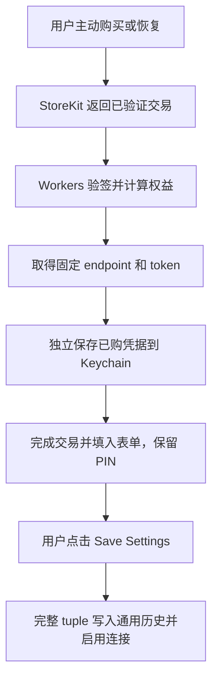

# KeeNotes iOS IAP 与凭据历史实施计划书

日期：2026-09-14  
状态：两端代码已实施并集成，本地验收通过，真实 Apple 环境配置与端到端验收待完成；结果见验收记录。本文保留实施时的模块设计和阶段安排。

## 1. 目标与已确认范围

在现有 KeeNotes iOS 基础上增加 Apple 年订阅购买和本机凭据历史。用户继续通过通用连接配置使用任意支持的远程服务；IAP 提供一种新的凭据获取渠道。

| 项目 | 已确认规则 |
| --- | --- |
| 商品 | 首版仅一个自动续订年订阅；用户暂定 US$8/年（USD，2026-09-14 确认），尚未写入 ASC；最终 Product ID 及区域价格配置待完成。 |
| 服务端 | Apple 购买交付与通知处理放在 keenotes-remote-workers。 |
| 渠道关系 | Gumroad 与 IAP 使用独立订阅链路、身份映射和 token；不绑定、不合并、不迁移两者云端数据。 |
| 客户端主入口 | 现有 endpoint、token、加密密码输入及 Save Settings 继续作为通用主流程。 |
| UI 导航 | 2026-09-19 更新：Purchase／购买与 History／历史与 Server Configuration 标题放在同一行；Purchase 使用小号系统按钮，打开独立 sheet；不增加顶部 segment。 |
| 功能可用性 | 客户端不以 StoreKit 购买状态限制原有功能；所填凭据的访问权限由对应服务端判断。 |
| IAP 填入 | 主动购买或恢复成功后填入 endpoint、token，保留用户的加密密码；仍需 Save Settings 才启用。 |
| 后台更新 | 续订、交易监听和启动恢复只维护购买与交付信息，不覆盖当前配置或正在编辑的表单。 |
| 凭据历史 | 本设备 Save 成功的完整 `(endpoint, token, pin)` 存入 Keychain；支持所有渠道。 |
| 历史列表 | 显示 endpoint、token 最后 4 位、来源 tag「通用 / IAP」及当前使用标记；PIN 不显示。 |
| 历史入口 | 放在 Server Configuration 标题右侧，打开独立历史 sheet。 |
| 时间戳 | 可在内部用于排序，首版界面不展示。 |
| 历史启用 | 点击条目先弹确认框；二次确认后替换完整配置、保存并自动连接，无需再点 Save。 |
| 删除历史 | 支持删除历史条目；只删除本机历史，不撤销远端凭据、取消订阅或删除笔记。 |
| 最低系统 | 保留现有 iOS 15 部署目标。 |
| Git | 不代用户提交 Git。 |

本文中的 `pin` 对应现有代码的 `encryptionPassword`，是用户设置的 E2EE 加密密码，不是 Apple 发放的密码。IAP 服务端不生成、接收或保存 PIN。

## 2. 实施前代码基线与接入位置

本节记录实施前的代码基线；实施后结果以 [验收记录](keenotes-ios-iap-acceptance.md) 和当前源码为准。2026-09-14 用户补充：停止 Simulator 测试，不下载运行时，后续设备验证仅允许联机 ip17。

以下判断来自实施前源码；任务记录和 Apple 文档用于补充背景。后续 ASC 检查、本地测试及集成结果已单独记录，不将本节历史判断视为实施后的现状。

| 现状 | 代码依据 | 实施影响 |
| --- | --- | --- |
| iOS 当前保存 endpoint 至 UserDefaults，token 和密码至 Keychain；保存后才更新内存配置。 | [SettingsService.swift](/Users/af/workspace.javafx/keenotes-mobile/keenotes-ios/KeeNotes/Services/SettingsService.swift:209) | 将历史接入通用保存边界；区分落盘成功和联网成功。 |
| Keychain 封装支持 String 读写，使用 `kSecAttrAccessibleWhenUnlockedThisDeviceOnly`。 | [KeychainService.swift](/Users/af/workspace.javafx/keenotes-mobile/keenotes-ios/KeeNotes/Services/KeychainService.swift:16) | 可存储版本化 JSON；沿用本机、解锁后可访问策略。 |
| 保存不同 endpoint/token 时会清理同步游标和本地已同步笔记；仅密码变化时重置同步状态。 | [SettingsView.swift](/Users/af/workspace.javafx/keenotes-mobile/keenotes-ios/KeeNotes/Views/SettingsView.swift:351) | 历史选择必须走统一配置应用流程，不能直接修改几个属性后连接。 |
| pending notes 没有按 endpoint/token/PIN 分组，连接成功会触发重试。 | [DatabaseService.swift](/Users/af/workspace.javafx/keenotes-mobile/keenotes-ios/KeeNotes/Services/DatabaseService.swift:59)、[PendingNoteService.swift](/Users/af/workspace.javafx/keenotes-mobile/keenotes-ios/KeeNotes/Services/PendingNoteService.swift:19) | 切换前必须协调待发送数据和正在进行的发送，避免跨账户发送。 |
| AppState 管理服务，App 前后台变化控制 WebSocket。 | [KeeNotesApp.swift](/Users/af/workspace.javafx/keenotes-mobile/keenotes-ios/KeeNotes/App/KeeNotesApp.swift:29) | 在应用生命周期接入购买监听，避免依赖设置页存活。 |
| Workers 已有固定 userauth token、KV 授权及订阅审计，但续费按时长累加。 | [authorization.ts](/Users/af/workspace.keenotes/keenotes-remote-workers/src/authorization.ts:26)、[schema.sql](/Users/af/workspace.keenotes/keenotes-remote-workers/schema.sql:16) | 复用身份与 token 基础，单独实现 Apple 按实际到期时间计算权益。 |
| 邮件逻辑将 KV 的 userId 当作收件地址。 | [notification.ts](/Users/af/workspace.keenotes/keenotes-remote-workers/src/notification.ts:59) | Apple 身份必须跳过旧邮件链路，不能作为邮箱处理。 |
| WebSocket 建连鉴权后，消息处理不重新检查订阅，也没有到期主动断连。 | [index.ts](/Users/af/workspace.keenotes/keenotes-remote-workers/src/index.ts:73)、[websocket.ts](/Users/af/workspace.keenotes/keenotes-remote-workers/src/websocket.ts:60) | 为 Apple token 补充持续授权检查与断连，保持原订阅链路行为。 |

参考项目的可复用行为：

- FooSnippets 先提交签名交易，取得凭据并持久化，随后才 `finish()`：[RVXFlarePurchaseManager.swift](/Users/af/workspace.macos/FooSnippets/Services/RVXFlarePurchaseManager.swift:524)。
- FooSnippets 将已购凭据和当前连接配置分开，填表时保留 PIN，随后由用户保存启用：[SyncSettingsView.swift](/Users/af/workspace.macos/FooSnippets/Views/SyncSettingsView.swift:427)。
- RVXFlare 已实现 Apple 官方库验签、身份映射、交易周期和通知处理：[storekit-verifier.js](/Users/af/workspace.ai/rvxflare/src/storekit-verifier.js:55)、[purchase-entitlements.js](/Users/af/workspace.ai/rvxflare/src/purchase-entitlements.js:35)。移植相应逻辑时适配 KeeNotes 数据结构，不引入 RVXFlare 的同步协议或 token 编码。

## 3. 用户流程

### 3.1 通用手动配置

用户输入 endpoint、token、PIN 和确认密码，点击 Save Settings。完成本地保存后记录历史，再按配置变化情况连接远程服务。

所有来源共用这条流程。凭据是否有效由远程服务返回结果决定；「已保存」「连接中」「连接失败」分别展示，不能把发起连接当作连接成功。

### 3.2 IAP 购买及主动恢复

UI 决策于 2026-09-19 更新：Purchase／购买与 History／历史与 Server Configuration 标题放在同一行，统一归入连接配置区域。Purchase 与 History 使用同一小号系统 bordered 圆角按钮及 footnote 字号，移除撑高标签的最小高度；Purchase 使用50%透明度主题蓝底，History 浅灰底，视觉层级为 Save Settings > Purchase > History；配置标题取消强制换行，紧接历史记录图标按钮，Purchase 靠右；图标保留本地化辅助功能名称。设置页顶部恢复纯标题；购买仍打开独立 sheet，保留 Server Configuration、Encryption、Save Settings 和 Preferences 的现有顺序，Save Settings 继续作为主要按钮。

订阅 sheet 按远程服务说明、年订阅价格与周期、购买按钮、恢复购买与管理订阅组织内容，并显示购买及交付状态。已有购买时提供「填入连接凭据」操作。面向用户的入口名称使用「订阅」及对应本地化文案，不直接使用技术缩写 IAP；具体按钮样式在实施时沿用现有主题，并验证窄屏标题布局和可访问性标签。

购买入口在尚未设置 token/PIN 时也可使用，并与首次配置向导协调，避免被向导遮挡。打开、关闭 sheet 保留原表单草稿和当前连接。用户主动购买或恢复完成并成功交付后，关闭订阅 sheet、返回设置页填入凭据，提示「凭据已填入，保存后开始使用」；仍需用户点击 Save Settings。若发生下文所述的迟到结果冲突，则保留已购信息并提供主动填入入口，不自动覆盖表单。

购买行为只交付 endpoint/token。没有填写并成功保存完整 PIN 时，不生成可一键启用的历史条目。

新版本初始化时先保留原完整配置；即使随后 IAP 替换了表单，原配置也能从历史找回。IAP 暂存凭据独立于历史，用户尚未点击 Save、切换页面或重启，也不丢失已购凭据。

主动购买/恢复完成后，只向仍对应这次操作的表单投递填入结果。若用户期间已修改表单、确认切换历史或保存另一配置，保留新交付凭据并提供再次填入入口，避免迟到结果覆盖用户操作。后台交易更新不自动填表。

### 3.3 凭据历史与二次确认

在 Server Configuration 标题右侧提供「历史」入口，点击打开独立历史 sheet。示意条目内容为：`endpoint · …ABCD · 通用/IAP · 当前使用`，其中 `ABCD` 为 token 最后 4 位。列表不显示 PIN，也不提供完整 token 的默认展示。

1. 用户点击历史条目，弹出确认框；此时表单、已保存配置、连接和最近使用排序均不变化。
2. 确认框显示目标 endpoint、token 尾号和 tag，提示切换会替换当前连接配置并重新连接；目标为另一服务空间时说明本地已同步缓存将重新加载。
3. 用户点击「取消」后保留当前输入、配置和连接。
4. 用户点击「确认切换」后执行切换保护，通过并完成本地应用后关闭历史 sheet，设置表单填入完整 endpoint/token/PIN 及确认密码，敏感字段沿用当前 SecureField 展示，自动连接；无需再点击 Save Settings。保护检查或本地应用失败时保留历史页并显示原因。
5. 本地应用失败时不展示切换成功；网络连接失败时保留已经成功保存的目标配置和历史，显示实际连接状态。

PIN 不展示在历史条目或确认框中。二次确认授权的是本次切换，不绕过待发送笔记检查。

## 4. iOS 实施设计

### 4.1 三类状态分别管理

| 状态 | 内容 | 持久化及变化时机 |
| --- | --- | --- |
| 表单草稿 | endpoint、token、PIN、确认密码 | 供用户编辑；IAP 交付可填入，尚未 Save 时不影响实际连接。 |
| 当前配置与历史 | 完整 tuple、来源信息、排序信息 | Keychain 持久化；通用 Save 或历史确认启用时更新。 |
| 已购交付信息 | Apple 交易身份、endpoint/token、权益与交付状态 | 单独持久化必要信息；没有 PIN，可先于通用 Save 存在。 |

来源 tag 仅用于展示，不参与鉴权或决定功能可用性。只有本机已验证交付且匹配 endpoint/token 的凭据标记为 IAP；手动输入的未知来源默认「通用」。不能根据域名、token 格式或尾号猜测来源。修改 PIN 不会使已识别的同一 IAP endpoint/token 丢失来源标记。

### 4.2 Keychain 历史和升级迁移

建议采用版本化 Codable 数据，并通过现有 Keychain 字符串封装保存。为避免「当前配置写成功、历史写失败」导致旧凭据丢失，建议将当前已保存 tuple 与历史放在同一个 Keychain 数据项中更新；SettingsService 继续提供现有界面所需属性。

历史条目包含：条目 ID、endpoint、token、PIN、来源、创建时间和最近使用时间。排序时间内部使用，首版 UI 不展示。

- 去重按完整 tuple：相同 endpoint/token 但不同 PIN 的成功保存保留为不同条目。endpoint 沿用保存时的标准化规则，token/PIN 不额外裁剪、改写或做大小写转换。
- 重复保存同一 tuple 更新最近使用时间；有可靠 IAP 来源记录时，不因手动重填降级为「通用」。
- UI 当前使用标记比较完整 tuple，不只比较 token 尾号或列表 ID。
- 不静默淘汰用户历史；用户可主动删除条目。遇到存储容量或写入错误时明确报告，不宣称历史已保存。
- 删除当前条目的历史副本不清除当前配置或断开连接；以后主动保存该配置可重新进入历史。
- 升级时将当前完整配置以「通用」补入历史并设为当前配置。迁移幂等，成功后才标记完成；不在每次启动时重新生成用户已经删除的历史。
- 旧 Keychain token/PIN 和 UserDefaults endpoint 在迁移成功前保留。Keychain 读取失败与「没有数据」必须区分，不能用空列表覆盖现有历史。
- 已迁移版本以新存储为凭据事实来源；遗留键只作兼容镜像或迁移输入，不能与新存储并行决定当前连接。

沿用本机 Keychain 可访问策略，不增加跨设备同步。历史保存的是连接凭据；笔记缓存仍采用当前单一活动服务的方式，不建立每个历史条目的独立本地笔记库。

### 4.3 统一保存与切换

将 SettingsView 中的配置应用逻辑移至由 AppState 管理的协调入口，手动保存和历史确认复用；保持当前通用表单和 Save Settings 的使用方式。

切换过程建议为：校验输入 → 串行进入应用操作 → 暂停新的发送与自动重试并等待/终止旧操作 → 检查 pending → 持久化当前配置和历史 → 按需更新本地同步状态 → 发布新配置并连接。

必须满足：

- 原完整配置在覆盖前已进入可恢复历史；历史或当前凭据存储失败时不继续覆盖和连接。
- tuple 发生变化且有待发送笔记时暂缓切换，保留原配置并提示先处理待发送内容；相同 tuple 的普通保存/重连不被这一检查拦截。
- 检查包含已加密 pending、旧格式 pending 和正在进行的发送；不能只在点击时查一次数量后任由重试继续运行。
- endpoint/token 变化沿用当前本地缓存与游标重建语义；PIN 变化处理同步状态，但不迁移或重新加密另一服务的历史数据。
- 为旧 WebSocket、HTTP、重试任务和异步保存增加配置版本/操作身份校验，迟到回调不能写入新服务的本地状态或清理新任务。
- Keychain 与 SQLite 不属于同一个事务。配置应用需要持久化切换标记或等价的启动恢复校验，防止 App 在两者更新之间退出后，用新 token 发送旧 pending 或混用旧游标；恢复完成前不开启重试。
- 失败信息区分本地保存失败、缓存切换失败与网络连接失败。保持旧配置可恢复；不得把清理失败忽略后继续启用不一致状态。

首版取舍：有 pending 时先阻止改变 tuple，不新增自动搬迁、自动删除或多账户 pending 队列。上述保护放在通用应用入口，覆盖历史切换和表单保存中的配置变更；普通输入和未改变 tuple 的保存保持原使用方式。

### 4.4 StoreKit 服务

- 使用 StoreKit 2 加载年订阅商品和本地化价格；处理用户取消、待批准、购买成功、验签失败、已购买待交付和已交付。
- 由 AppState 启动一次交易监听；启动/回前台核对当前权益、补处理未完成交付。监听和重试任务有明确生命周期与取消机制，UI 状态在 MainActor 更新。
- `AppStore.sync()` 只用于用户主动恢复，日常启动不触发恢复认证弹窗。
- 交易处理按交易身份合并并发请求；只有服务端完成交付并且本机已持久化交付凭据后，才对成功交付的购买调用 `finish()`。
- 服务端临时故障、KV 激活传播延迟或 Keychain 暂时不可访问时保留待交付状态，支持退避重试及手动重试，不引导再次付费。
- 已过期/撤销等终态交易按服务端确认结果完成相应处理，避免无限重试或重新授予权益；启动恢复和购买成功的处理分支明确区分。
- 恢复相同有效购买必须返回同一 IAP token。没有当前有效订阅不删除用户的通用配置和凭据历史。
- 保持 iOS 15 兼容：对 StoreKit 环境等 API 使用可用性分支；不为直接复制 macOS 参考代码提升最低系统版本。

## 5. Workers 实施设计

### 5.1 接口契约

以下路径与字段为建议契约，实施开始时冻结并由客户端、服务端共同使用。

| 接口 | 输入 | 成功结果与规则 |
| --- | --- | --- |
| `POST /iap/apple/provision` | `signed_transaction`、`environment` | 返回 `endpoint`、`token`、`entitlement_status`、`expires_at`、`provisioning_seconds`。无需已有 access token，以 Apple 签名交易作为交付依据。 |
| `POST /iap/apple/notifications` | Apple 的 `signedPayload` | 验签并持久化事件和权益变化，可靠安排授权更新；重复通知可安全重试。 |

`expires_at` 统一为 UTC Unix 秒，交易原始日期按 Apple 毫秒字段保存并显式转换。`provisioning_seconds` 是激活传播等待提示，不是授予的订阅时长，也不保证届时网络必定恢复。失败响应使用稳定错误码，区分无效交易、无有效权益、配置错误和可重试故障；包含凭据的响应禁止缓存。

生产接口与 Sandbox 接口固定配置，不从用户可编辑的同步 endpoint 推导。服务端固定路径选择环境，请求中的 environment 仅校验一致性；服务器独立验证签名中的环境、应用和产品。客户端不持有 Apple 服务端私钥或管理员凭据。

### 5.2 Apple 身份、交易及固定 token

新增数据按以下职责组织，具体表名可在实现时统一：

| 数据 | 关键字段及约束 |
| --- | --- |
| Apple 身份映射 | `(environment, bundle_id, app_transaction_id)` 唯一；关联一个独立的 userauth 用户和固定 token。 |
| Apple 交易周期 | 环境、应用、`originalTransactionId`、`transactionId`、Product ID、购买/到期时间、撤销及续订状态；交易 ID 在对应环境与应用下唯一。 |
| Apple 通知事件 | 环境、通知 UUID、类型/子类型、签名时间、处理结果和待重试信息；UUID 用于通知去重。 |

以验签后的 `appTransactionId` 识别该应用的 Apple 购买身份，`originalTransactionId` 标识订阅链，`transactionId` 标识交易周期。不得用客户端随机 UUID 或未经验证的字段创建永久身份；关键身份字段缺失时明确失败并保留恢复途径，不生成第二个临时 token。

Apple userId 使用明确的来源命名空间，避开 Gumroad 的邮箱身份。创建映射和固定 token 时依赖数据库唯一约束及事务/批处理解决并发竞争；竞争失败的一方读取已经创建的记录。恢复、续订以及到期后重新订阅复用原 IAP token。

保留现有 `userauth` 不变映射、`notes.token` 归属方式和 `subscriptions` 审计。Apple 审计来源为 `apple`，外部事件标识带来源和环境，避免与 Gumroad sale ID 冲突；已有非唯一审计索引不能充当 Apple 事件的并发去重保障。

### 5.3 权益计算与事件处理

Apple 权益按实际交易日期和续订信息计算，不走现有 `authorizeUser()` 的累加时长逻辑。

| 情况 | 行为 |
| --- | --- |
| 首购 / 正常续订 | 更新对应交易周期及当前有效权益，创建或重新激活固定 token。 |
| 关闭自动续订 | 记录续订意愿变化，保留当前付费期，不立即撤销访问。 |
| 宽限期 | 若 ASC 启用，按已验证续订信息中的实际宽限期截止时间授权；不能无限延长。 |
| 扣款重试但无有效宽限期 | 不额外授予超出当前有效服务期的访问。 |
| 到期 / 宽限期结束 | 重新计算权益，无有效权益时撤销访问；保留笔记和 token 映射。 |
| 退款 / 撤销 / 退款撤回 | 更新对应交易周期后重新计算当前权益；旧周期退款不能误撤销更新的有效周期。 |

参考 RVXFlare 的交易周期模型处理乱序通知，不能仅以通知到达顺序或最近 signedDate 决定当前订阅。客户端提交、后台通知和恢复购买都写入同一 Apple 权益事实来源。

D1 是 Apple 权益事实来源，KV 与 DO 授权是可重建结果。记录权益版本及待应用状态；授权写入串行或进行版本核对，避免旧写入在新撤销之后重新放开访问。D1 成功而 KV/DO 失败时必须能继续补偿，重复事件不能跳过未完成的授权更新。

通知处理只有在事件及后续处理任务可靠持久化后才返回成功；否则返回可重试失败。补充失败重试和通知遗漏的对账路径：按已知订阅通过 App Store Server API 核对当前状态，并可重放通知历史，不能依赖用户再次打开 App 才修正退款或续订状态。

### 5.4 兼容现有授权和数据服务

- Apple token 继续使用现有 Bearer token 和 WebSocket 协议；客户端无需因来源不同使用另一套笔记 API。
- 保持现有 Gumroad/admin 的身份、时长累加和撤销行为；Apple 使用独立权益计算入口。
- Apple 身份不会进入欢迎邮件及 Gumroad 到期提醒链路；跳过依据持久化来源信息，不通过猜测字符串是否像邮箱判断。
- Apple 到期/撤销时保留 D1 笔记和 userauth 映射；续订恢复访问同一数据空间。来源独立意味着 IAP 不能看到 Gumroad token 下的笔记。
- 针对 Apple token，在 HTTP/WS 授权路径核对有效权益，不能把 KV 的传播延迟当作新的授权时长。已建立 WS 需接收权益更新，并在期限到达或撤销时停止收发、关闭连接。
- Apple 的期限和版本状态在 DO 休眠/恢复后仍可校验；覆盖握手补发、WS 写入与 HTTP 广播，防止仅关闭新连接却保留旧连接访问。
- 保留其他来源的鉴权行为；通过旧客户端回归确认兼容。新增支付链路及触达的日志不输出完整 token、PIN、签名交易或笔记正文。

### 5.5 Workers 运行时与环境

RVXFlare 使用 Apple 官方 Server Library，并已有 Workers 运行时适配。先验证按请求动态加载、`nodejs_compat` 和 fetch 适配在 KeeNotes 中可用，再决定必要的兼容日期与依赖升级，不直接整体覆盖现有配置。

2026-09-14 用户将部署方式调整为同一生产 Worker 和现有 D1/KV/DO 处理 Production 与真实 Sandbox；不新建测试资源。采用固定的两套交付/通知路径，身份和 token 按环境隔离，Sandbox 笔记属于独立测试身份。每条服务端路径仅接受相符环境的已验签交易；cron 按环境分别对账。发行构建也必须能按交易环境选择 Sandbox 路径，不能简单按 Debug/Release 区分。最新路径见集成契约。

本地 StoreKit Configuration 用于客户端购买状态测试，不能把本地测试签名当作 Apple Sandbox 验签通过。真实验签、续订与回调在真实 Sandbox 中验收。

## 6. 预计改动范围

新增文件名为建议名称，尚未创建。实现按职责组织，不为每个状态额外拆分模块。

| 项目 / 位置 | 预计职责 |
| --- | --- |
| iOS：新增 `ConnectionCredentialsStore.swift` | 版本化 Keychain 当前配置、历史、来源、去重和旧配置迁移。 |
| iOS：新增 `ConnectionConfigurationCoordinator.swift` | 通用保存、历史启用、发送暂停、配置版本校验和切换失败恢复。 |
| iOS：新增 `StoreKitPurchaseService.swift` | StoreKit 商品、购买、恢复、监听、交付客户端及必要的已购缓存。 |
| iOS：新增 `CredentialHistoryView.swift`、`SubscriptionView.swift` | 两个独立 sheet：历史条目和二次确认；年订阅、恢复购买与交付状态。 |
| iOS：调整 SettingsView / SettingsService / KeychainService / AppState | 复用 TopHeaderView 右侧位置增加订阅入口，在 Server Configuration 标题右侧增加历史入口；接入 sheet 并保留草稿、现有通用输入与保存入口；Keychain 读取错误可区分。 |
| iOS：按需调整 WebSocketService / PendingNoteService / ApiService / DatabaseService | 配置切换期间的发送协调、旧回调隔离、同步状态更新与启动恢复。 |
| iOS：project.yml、Xcode project、Info.plist、测试配置 | 注册源码与测试，配置商品 ID、两套交付地址和 IAP capability；核对实际工程生成方式。 |
| Workers：新增 Apple 路由、验签、权益模块及数据库 migration | 接口、唯一约束、交易周期、事件记录、授权更新与补偿对账。 |
| Workers：调整 index / types / notification / auth / websocket | 路由注册、来源识别、邮件隔离、Apple HTTP/WS 权益执行。 |
| Workers：package、wrangler、测试及运维脚本 | 官方库运行时适配、隔离环境、重试对账与部署验证。 |

FooSnippets 和 RVXFlare 作为参考，不在本次计划中修改。Android、JavaFX 客户端以及其他远程服务不增加 IAP 代码，也不改其通信协议。

## 7. 实施顺序与阶段交付

| 阶段 | 工作 | 完成标准 |
| --- | --- | --- |
| A：冻结契约与建立验证基线 | 确认接口字段、错误码、历史存储迁移与切换规则；确认现有构建和测试入口；验证 Apple SDK 的 Workers 兼容性。 | 两端共享接口约定；现有问题与新增问题可区分；完成运行时验证。 |
| B：通用凭据历史 | 先实现当前配置迁移、历史存储/列表/删除、二次确认与统一保存切换。 | 不依赖 IAP 即可保存和切换现有远程凭据；旧配置可找回；无串发和迟到覆盖。 |
| C：Apple 服务端 | 实现独立身份、验签、幂等发放、通知、权益执行及补偿对账。 | Sandbox 中同一身份始终同一 token；到期/退款覆盖 HTTP 和现有 WS；旧订阅回归通过。 |
| D：iOS IAP 集成 | 配置区购买入口与独立购买 sheet、主动恢复、后台交易监听、交付缓存及表单填入。 | 现有设置主页面结构保留；sheet 开关不丢草稿；已购信息不丢失；填表不等于启用；保存后进入通用历史；不影响其他渠道凭据。 |
| E：端到端与发布准备 | 真实 Sandbox/TestFlight 回归；配置正式商品、回调和构建；准备审核材料。 | 下表关键用例通过，提交物可审阅，生产与测试环境隔离核对完成。 |

先落地历史，再接入 IAP，使原凭据保留成为购买流程的前置保障。实施期间持续简短更新 implementation_note.md；代码提交由用户自行处理。

## 8. 验收矩阵

| 类别 | 必须验证的场景及结果 |
| --- | --- |
| 旧配置升级 | 已有完整配置被保留；迁移重试不重复；写入失败不删除旧值；用户删除历史后重启不自动恢复被删条目。 |
| 通用保存 | 其他渠道与 IAP 均可手动输入并保存；相同 tuple 去重；不同 PIN 分条；服务器离线仍区分本地保存与连接状态。 |
| 导航与草稿 | 配置标题与 Purchase、History 同行；Purchase 打开独立 sheet；主页面没有新增 segment 或内嵌购买区。取消或直接关闭 sheet 不丢草稿、不切换连接；主动购买交付成功返回填表，仍需 Save。 |
| 历史展示 | 仅显示 endpoint、token 最后 4 位、通用/IAP tag、当前使用标记；不显示 PIN 或时间戳；尾号不用于条目身份判定。 |
| 历史确认 | 点击条目只弹框；取消无表单/连接/排序副作用；确认后完整替换并自动连接；连点和旧弹框不会重复切换。 |
| 保存失败 | Keychain 拒绝访问、读取失败、写入失败、数据库切换失败和切换中退出均可恢复，不混用两个账户的状态。 |
| pending 与在途发送 | 待发送内容阻止更换 tuple；正在发送、自动重试和旧 WS 回调不会越过切换边界进入新配置。 |
| IAP 主流程 | 无 token/PIN 也可购买；购买交付填入 endpoint/token 并保留 PIN；Save 后才连接及新增完整历史。 |
| 迟到与后台交易 | 后台续订、启动恢复、晚到购买结果不覆盖用户当前输入或另一已启用配置；已购凭据可再次主动填入。 |
| 购买异常 | 用户取消、待批准、商品不可用、验签失败、服务端失败、Keychain 失败、KV 延迟及进程退出均有可恢复状态，不要求重复付费。 |
| 恢复与身份 | 重装/换设备后通过 Apple 恢复有效购买取得同一 token；PIN 仍由用户提供；IAP 与 Gumroad 同时存在也不合并身份或笔记。 |
| 事件一致性 | 客户端和通知并发、通知先到、重复请求、乱序事件、旧周期退款、退款撤回、授权更新中断及漏通知对账。 |
| 权益边界 | 关闭续订不提前停用；正常续订延续授权；到期/退款正确限制 HTTP 和现有 WS；恢复授权后原 token 可重连。 |
| 兼容回归 | 原 Gumroad/admin 授权、手动 token、E2EE、发笔记、离线重试、Review、搜索及前后台重连保持正常；其他端使用现有协议。 |
| 系统与环境 | iPhone/iPad 布局、iOS 15 API 兼容、Debug/Release 参数、真实 Sandbox/TestFlight 和 Production 数据隔离。 |

测试重点放在身份、幂等、持久化失败和切换竞态，不用仅重复实现步骤的测试代替行为验收。此表定义门槛；实际通过项和未完成项见验收记录。

## 9. 发布配置与尚待确定项

| 项目 | 确定时机 |
| --- | --- |
| 年费暂定 US$8/年（USD）；区域价格及最终 Product ID 待配置 | 用户已确定基准金额和币种，尚未创建或设置 ASC 商品。 |
| 订阅组、商品名称/本地化、使用条款及隐私政策链接 | 购买界面与审核材料定稿之前。 |
| Billing Grace Period、试用/优惠、Family Sharing | ASC 配置前明确；不默认为已启用。宽限期处理按实际配置验收。 |
| App Apple ID、Sandbox 服务域名、两套通知地址 | 服务端环境配置和真机联调之前；bundle ID 以现有工程 `cn.keevol.keenotes` 为基线核对。 |
| Apple 信任证书和 Server API 所需密钥配置 | 验签及补偿对账联调之前；敏感配置仅放服务端。 |

数据库使用新增 migration，先备份和验证，再应用生产变更；不使用重建 schema 的方式覆盖现有数据。生产服务先具备处理新客户端请求的能力，再发布 iOS。

发布时核对商品、App 版本、通知地址和构建配置。首次订阅与新 App 版本一起提交，审核说明写明无需预先取得 token/PIN 即可进入购买入口。发布前准备故障恢复方案：可暂停新购买，但必须保留已售订阅的恢复交付、通知处理、补偿任务及所有身份映射，不能简单回退到完全不认识 IAP 的服务端版本。

平台参考：

- [Apple：Transaction.finish()](https://developer.apple.com/documentation/storekit/transaction/finish%28%29)
- [Apple：AppStore.sync()](https://developer.apple.com/documentation/storekit/appstore/sync%28%29)
- [Apple：App Store Server Notifications V2 类型](https://developer.apple.com/documentation/appstoreservernotifications/notificationtype)
- [Apple：App Store Server APIs 中的 appTransactionId](https://developer-mdn.apple.com/videos/play/wwdc2025/249/)
- [Apple：首次提交 In-App Purchase](https://developer.apple.com/help/app-store-connect/manage-submissions-to-app-review/submit-an-in-app-purchase)

这些资料用于确认平台接口与流程；项目当前行为仍以第 2 节列出的源码为依据。实际实施前重新核对相关 API、运行时和 ASC 配置。

最终位置调整：History 紧跟配置标题，Purchase 靠右；现有小号按钮、50%主题蓝和灰色样式保持，构建及模拟器截图核验通过。
