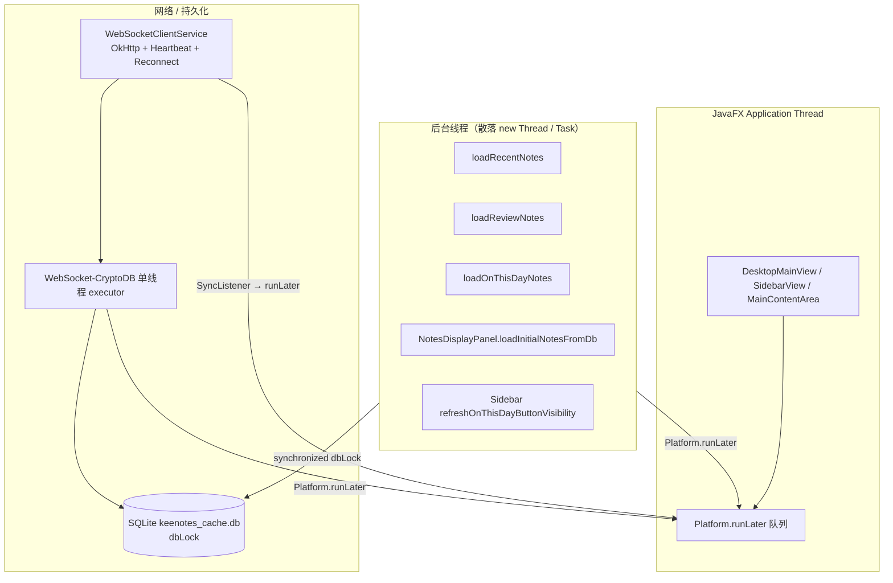
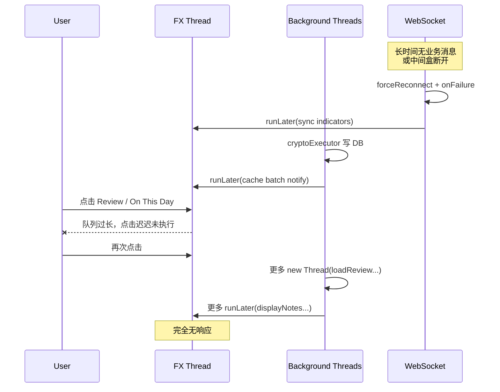

# KeeNotes JavaFX 桌面版 — 整体性能与稳定性分析报告

> **关联问题单**：[`overall_performance_optimization.md`](./overall_performance_optimization.md)  
> **分析日期**：2026-05-29  
> **代码基线**：`keenotes-mobile` 主分支当前 `src/main/java`（52 个 Java 源文件）  
> **参考文档**：根目录 [`performance_tuning_report.md`](../performance_tuning_report.md)（早期静态诊断，部分项已修复）

---

## 1. 执行摘要

用户报告：应用**长期驻留**后，点击 UI 切换功能（尤其 **「On this day in years past」**）出现**无响应**，随后**所有按钮**均失效；日志仅有 WebSocket 心跳超时与重连相关 WARNING，缺少明确 UI 层错误。

**静态分析结论**：当前最可能的主因不是单一 SQL 慢查询，而是 **JavaFX Application Thread（下称 FX 线程）被 `Platform.runLater` 任务洪泛 + 不可取消的后台 `Thread` 叠加** 导致的「假死」。网络间歇性中断后的 WebSocket 重连会放大这一问题，但通常不是唯一根因。

| 优先级 | 主题 | 与本次现象关联度 |
|--------|------|------------------|
| **P0** | FX 线程队列积压（多 listener × 多 panel × 无防抖加载） | **高** — 日志显示 1 秒内 8 次 `loadReviewNotes`，每次 spawn 新线程 |
| **P0** | 后台任务无取消/去重（`new Thread` 散落 25+ 处） | **高** — `Thread-21`…`Thread-30` 递增即证据 |
| **P1** | WebSocket 重连路径可能双重 `scheduleReconnect` | **中** — 心跳 `forceReconnect` + `onFailure` 叠加 |
| **P1** | On This Day 全量 `displayNotes`（非分页） | **中** — 笔记多年同日较多时，一次加载可阻塞 FX |
| **P1** | Sidebar 每次 sync 批量插入都查 `getNotesOnThisDayCount` | **中** — 重连后 sync 完成会触发 |
| **P2** | 资源关闭 / listener 生命周期 | **低~中** — 多数已有 `dispose()`，长期仍须验证 |

---

## 2. 问题背景与用户日志解读

### 2.1 用户操作路径（来自问题单）

1. 应用长时间运行（驻留系统托盘/后台）。
2. 经历网络静默 → WebSocket 心跳超时（877669ms ≈ **14.6 分钟**无消息）→ 强制重连。
3. 点击「On this day in years past」无反应；再点其他按钮也无反应。
4. 用户最终关闭应用（日志末尾 `MainContentArea disposed`）。

### 2.2 日志时间线要点

| 时间 | 事件 | 含义 |
|------|------|------|
| 22:06:17 | `Heartbeat timeout (877669ms silent), forcing reconnect` | 连接处于「半开」僵尸状态，应用层心跳判定失效 |
| 22:06:17 | 同时出现 `Socket closed` 与 **两次** `Scheduling reconnect`（attempt 1 与 2） | **疑似重连调度叠加**（见 §5.3） |
| 22:06:20 | 重连成功，`Sync complete … 0 notes` | 重连本身成功，未拉取新数据 |
| 22:24:21 | `EOFException` → 再次重连成功 | 典型中间设备/Cloudflare 空闲断开 |
| 22:27:42 ~ 22:28:13 | 密集 `loadRecentNotes` / `loadReviewNotes`，`gen=1..8` | **FX 仍在处理导航**，但用户已在快速切换 Review |
| 22:28:28 | `MainContentArea disposed` | 用户退出 |

### 2.3 关键缺失日志

在整个片段中 **没有出现** `loadOnThisDayNotes` / `LoadOnThisDayNotes` / `Switching to mode: ON_THIS_DAY` 等记录。

可能解释（按概率）：

1. **点击时 FX 线程已积压**，`ToggleButton.setOnAction` / `switchToMode` 尚未执行到打日志处（最符合「全按钮失效」）。
2. 用户实际在 **Review 模式** 下快速点周期按钮（日志强烈支持：22:28:10~13 连续 8 次 `loadReviewNotes`）。
3. On This Day 在设置中关闭或按钮 `visible=false`（`SidebarView` 仅在 `getNotesOnThisDayCount() > 0` 时显示按钮）。

因此：**不能仅凭日志断定 On This Day 逻辑本身有 bug**，更应优先治理 **全局 FX 线程与任务模型**。

---

## 3. 架构与线程模型概览



### 3.1 模块职责

| 模块 | 职责 | 生命周期 |
|------|------|----------|
| `DesktopMainView` | 模式切换、快捷键、On This Day 午夜刷新 | 窗口级 |
| `MainContentArea` | 5 种模式面板、笔记加载、WS/Cache listener | 有 `dispose()` |
| `NotesDisplayPanel` ×4 | 列表虚拟化、`loadGeneration` 防陈旧回调 | 各有 `dispose()` |
| `WebSocketClientService` | 同步、心跳、指数退避重连 | `ServiceManager` 单例 |
| `LocalCacheService` | SQLite 缓存、`dbLock`、变更通知 | 单例 |

### 3.2 数据规模（来自用户日志）

- `totalCount=19478` 条本地缓存笔记。
- Review 7 天：`43` 条（分页首批 20 条，正常）。
- 说明：**Note 模式 count 大**，但首批 DB 查询仅 20 条，单次通常 <100ms；风险在**频繁重复加载**与 **FX 渲染**，而非 count 查询本身。

---

## 4. 相对旧版诊断的已改进项

根目录 `performance_tuning_report.md` 中部分建议**已在当前代码落地**，分析时应避免重复劳动：

| 旧报告项 | 当前状态 |
|----------|----------|
| UI 组件 `dispose()` 与 listener 引用保存 | ✅ `MainContentArea`、`NotesDisplayPanel`、`SidebarView` 等已实现 |
| `NoteCardView` 每张卡监听全局 theme/font | ✅ 已移除；改由 `NotesDisplayPanel.listView.refresh()` 统一刷新 |
| `ListView` 虚拟化替代大 `VBox` | ✅ 已使用 `ListView` + `NoteListCell` |
| `showLoading()` 先清空列表 | ✅ 已改为**保留旧数据**，失败不空白（`NotesDisplayPanel.showLoading`） |
| `SimpleForwardServer` executor 泄漏 | ✅ 已保存 `executorService` 并在 `stop()` 中 `shutdownNow` |
| `Main.stop()` 停止 import server | ✅ 已调用 `SimpleForwardServer.stop()` |
| `ApiServiceV2.close()` | ✅ 已实现，`ServiceManager.shutdown()` 会调用 |
| `loadGeneration` 丢弃陈旧 UI 回调 | ✅ `NotesDisplayPanel` 已实现 |

**尚未系统性解决**：统一线程池、任务取消、导航防抖、WebSocket 重连去重、On This Day 分页。

---

## 5. 详细发现

### 5.1 [P0] JavaFX 线程队列积压 — 「全 UI 无响应」的首要怀疑点

#### 机制

FX 线程同一时刻只处理一个 `Runnable`。以下路径都会向队列追加工作：

1. **`LocalCacheService`**：每次 `insertNote` / `insertNotesBatch` 后 `Platform.runLater(() -> notify…)`（`LocalCacheService.java:386-409`）。
2. **`MainContentArea` WebSocket listener**：`onSyncProgress` / `onRealtimeUpdate` 等对**多个** `NotesDisplayPanel` 调 `showSyncIndicator`（`MainContentArea.java:145-185`）。
3. **每个 `NotesDisplayPanel`** 另有独立 WebSocket listener（`NotesDisplayPanel.setupSyncStatusListener`，约 176 行起）— 与 `MainContentArea` **重复**。
4. **每次模式切换动画** `showMode`：`FadeTransition` 150ms × 2，完成后再 `loadRecentNotes()`（`MainContentArea.showMode`，1021-1024 行）。
5. **用户快速点击**：每次 `loadReviewNotes` / `loadRecentNotes` 再 `new Thread`，完成后又一次 `Platform.runLater`。

当队列深度达到数百～数千时，**新点击事件排在队尾**，表现为整个窗口「死机」，而后台线程日志仍在打印（与用户日志一致：后台 Thread-22~30 仍在跑，用户却觉得 UI 死了）。

#### 日志证据

```
22:28:10.175 loadReviewNotes (7 days)
22:28:11.357 loadReviewNotes
22:28:11.890 loadReviewNotes
… 共 8 次，gen=1..8，间隔 < 200ms
```

**没有任何 generation 取消机制**；旧线程完成后仍会 `Platform.runLater`，进一步加剧队列。

#### 建议

- 引入 **`LoadCoordinator` / `Debouncer`**（200~300ms）：同一面板只保留最新 load token。
- 所有 DB 加载走 **单线程 `uiDbExecutor`** + `Future.cancel(true)`。
- **合并 WebSocket UI 回调**：仅当前可见 `NotesDisplayPanel` 更新 sync 指示器；删除 panel 级重复 listener 或改为弱引用广播。
- 对 `Platform.runLater` 使用 **合并策略**（例如 `AnimationTimer` 每帧最多刷新一次 sync 状态）。

---

### 5.2 [P0] 后台任务模型：散落 `new Thread`，不可取消

#### 统计（`rg "new Thread" src/`）

| 文件 | 约计次数 | 典型场景 |
|------|----------|----------|
| `MainContentArea.java` | **11** | `loadRecentNotes`、`loadReviewNotes`、`handleSearch`、重试线程 |
| `NotesDisplayPanel.java` | 2 | 首屏/加载更多分页 |
| `SidebarView.java` | 1 | On This Day 按钮可见性 |
| `ServiceManager.java` | 3 | 初始化/重连 |
| 其他（Settings、AI、Import…） | 若干 | 次要 |

**违反 `AGENTS.md` 建议**：长时间任务应优先 `Task`/`Service`，且须可取消。

#### 典型问题代码模式

```java
// MainContentArea.loadReviewNotes — 每次调用新建线程，无中断标志
new Thread(() -> { ... Platform.runLater(() -> reviewNotesPanel.displayNotesWithPagination(...)); }).start();
```

重试路径还会 **再嵌套** `new Thread(() -> { Thread.sleep(2000); loadReviewNotes(period); })`（489-496 行），网络/缓存未就绪时可能指数级堆积。

#### 建议

- 定义 `AppExecutors`：`uiDb`（单线程）、`network`（有界）、`import`（单线程）。
- 每次加载持有 `AtomicReference<Future<?>> currentLoad`，新加载前 `cancel(true)`。
- JavaFX 场景绑定 `Task` 的 `runningProperty` 到 loading UI。

---

### 5.3 [P1] WebSocket 重连：心跳强制断开 + `onFailure` 双重调度

#### 现状

- 心跳：`HEARTBEAT_TIMEOUT_SEC = 75`，但用户日志显示 **877669ms** 才触发 — 说明 `lastMessageTime` 在长时间内仍被更新，或心跳线程/scheduling 异常（需运行期用 JFR 确认）。
- `forceReconnect()`：`ws.cancel()` → `cleanup()` → `scheduleReconnect()`（`WebSocketClientService.java:620-630`）。
- `onFailure`：`cleanup()` → `scheduleReconnect()`（251-263 行）。

当 `cancel()` 导致 socket 关闭时，OkHttp 往往**再回调** `onFailure`，从而 **连续两次** `scheduleReconnect()`。用户日志：

```
Scheduling reconnect in 1000ms (attempt 1/10)
Scheduling reconnect in 2000ms (attempt 2/10)  // 几乎同时
```

`scheduleReconnect` 虽会 `cancel` 上一个 `reconnectTask`，但 **`reconnectAttempts` 仍会递增两次**，可能导致更快进入 offline 模式或重连抖动。

#### 建议

- 增加 `reconnectScheduled` 原子标志，或合并为「单一重连状态机」。
- `forceReconnect` 时设置 `suppressFailureReconnect`，在 `onFailure` 中跳过调度。
- 记录 `lastMessageTime` 更新点（ping/pong/业务消息）便于诊断 877s 异常。

---

### 5.4 [P1] 「On this day in years past」专项

#### 调用链

```
SidebarView.onThisDayButton.onAction
  → DesktopMainView.onNavigationChanged(ON_THIS_DAY)
  → switchToMode → mainContent.showMode + loadOnThisDayNotes()
```

`loadOnThisDayNotes()`（`MainContentArea.java:519-600`）：

1. 缓存未就绪时递归 `new Thread` + `sleep` 重试（与 Review 相同反模式）。
2. 使用 `Task` 调 `localCache.getNotesOnThisDay()` — **良好方向**，但仍手动 `new Thread(task)` 而非 `Task` 内置执行器。
3. 成功时 `onThisDayNotesPanel.displayNotes(notes, …)` — **一次性装入内存，无分页**。

#### SQL 特征

`buildOnThisDayQuery()`（`LocalCacheService.java:742-774`）对 **2000..去年** 每一年构造 `(created_at >= ? AND created_at <= ?)`，用 **OR** 连接（最多约 25 个区间）。已有 `idx_cache_created_at` 索引，一般可接受，但：

- 返回行数**无 LIMIT**；若历年同日笔记很多，解密/构建 `NoteData` 列表耗时上升。
- `displayNotes` 在 FX 线程 `appendUniqueNotes` → 触发大量 `ListView` cell 创建（虽虚拟化，首次仍重）。

#### Sidebar 额外负载

`refreshOnThisDayButtonVisibility()` 在 **每次** `onNotesInserted` 批量回调时启动新 `Thread`+`Task` 查询 count（`SidebarView.java:368-415`）。重连后若有批量 sync，会并发多个 count 查询。

#### 建议

- On This Day 改为与 Review 相同的 **`displayNotesWithPagination`** 或专用分页 API。
- `loadOnThisDayNotes` 纳入全局 LoadCoordinator；打 **INFO** 日志（开始/结束/条数/耗时）。
- Sidebar visibility 查询：**防抖 500ms** + 取消上一次 Task。

---

### 5.5 [P1] 模式切换与动画叠加加载

`MainContentArea.showMode`（993-1048 行）：

- 若 `targetPanel == currentPanel` **直接 return** — 若 `currentPanel` 状态与 `visible` 不一致，可能导致「点了没反应」的边缘 case。
- 切换到 Note 模式时，动画结束 **无条件** `loadRecentNotes()`，即使用户刚离开又回来，也会再 spawn 线程。

`DesktopMainView.switchToMode` 在 `loadDefaultData=true` 时：

- REVIEW → 默认 `loadReviewNotes("7 days")`
- ON_THIS_DAY → `loadOnThisDayNotes()`

快速在 Sidebar 切换 Note ↔ Review ↔ On This Day 时，**并行多个加载线程** + **多个 fade 动画**。

#### 建议

- 切换模式时 **取消进行中的 fade** 或禁用动画（设置项「减少动效」）。
- `showMode` 仅在数据过期时加载（版本号/最后加载时间戳）。
- ON_THIS_DAY 切换时若已在加载中，显示 loading 而非静默 return。

---

### 5.6 [P2] Listener 与资源生命周期（残余风险）

#### 已做得较好的部分

- `MainContentArea.dispose()` 移除 account、ServiceManager、WebSocket、LocalCache listener（307-329 行）。
- `NotesDisplayPanel.dispose()` 递增 `loadGeneration` 并使 theme/font listener 失效（144-154 行）。
- `Main.stop()` → `mainView.dispose()` → `ServiceManager.shutdown()` 链路完整。

#### 残余问题

| 项 | 说明 |
|----|------|
| `ReviewPeriodsPanel` | theme listener 匿名 lambda，**无 dispose**（长期影响较小） |
| `onThisDayButton` hover handler | `updateOnThisDayButtonStyle` 每次调用 **重复** `setOnMouseEntered/Exited`（`SidebarView.java:311-335`），可能累积 handler |
| `LocalCacheService.close()` | 仍可能在上层误调后通过 `ensureInitialized` 复活（旧报告 P2，需复核 776 行附近） |
| SQLite `dbLock` | 所有读写在同锁；WebSocket 批量写入时，多个 UI 读线程会 **排队**，拉长后台任务占用时间 |

---

### 5.7 [P2] `NoteCardView` 渲染成本（长期运行）

每张可见卡片包含：

- 只读 `TextArea` + 隐藏 `Text` 测高 + `Canvas` 边框动画 + 多个 width/layout listener（`NoteCardView.java`）。

`ListView` 虚拟化减轻场景图节点数，但：

- 快速 `listView.refresh()`（主题/字体快捷键）会 **重建可见 cell**。
- `AnimationTimer` 边框动画若未在 cell 回收时 `dispose`，可能泄漏（需确认 `NoteListCell.updateItem` 路径）。

---

## 6. 根因假设（针对本次 incident）

综合日志与代码，推荐按以下顺序排查/修复：



**假设 A（主）**：FX 队列积压 → 所有按钮无响应；日志中密集 `loadReviewNotes` 是果不是因。  
**假设 B**：`dbLock` 与批量 sync 叠加，后台线程变慢，runLater 完成更慢，加剧 A。  
**假设 C**：On This Day 全量加载在 A 基础上压垮 FX（需多年同日大量笔记才明显）。  
**假设 D**：WebSocket 双重重连导致短暂 offline / 状态错乱（更可能影响 sync 指示器，而非单独导致全 UI 死）。

---

## 7. 修复路线图

### Phase 1 — 止血（1~2 天，优先验证 incident）

1. **LoadCoordinator**：`loadRecentNotes` / `loadReviewNotes` / `loadOnThisDayNotes` / `handleSearch` 统一取消+去重。
2. **导航防抖**：Review 周期按钮、Sidebar 模式切换 250ms debounce。
3. **WebSocket 重连去重**：`forceReconnect` 与 `onFailure` 互斥调度。
4. **诊断日志**：FX 队列深度（自定义 `runLater` 包装）、每次 load 的 `token/cancelled/duration`、On This Day 开始/结束。

### Phase 2 — 结构治理（3~5 天）

1. `AppExecutors` 替换全部数据加载类 `new Thread`。
2. 合并重复 WebSocket UI listener（仅 `MainContentArea` 或仅当前 panel）。
3. On This Day 分页 + Sidebar count 查询防抖。
4. `showMode` 可选禁用动画 / 避免重复 `loadRecentNotes`。

### Phase 3 — 深度优化（按需）

1. `NoteCardView` 轻量化（`Text`/`Label` 替代常驻 `TextArea`）。
2. `LocalCacheService` 读写分离或 WAL 模式减少锁竞争。
3. 运行期监控：JFR、VisualVM、`jcmd Thread.print`。

---

## 8. 验证计划

### 8.1 复现脚本（对齐用户场景）

1. 启动应用，登录，保持运行 **>30 分钟**。
2. 模拟网络：断开 Wi-Fi 15 分钟 → 恢复（或代理 idle timeout）。
3. 观察日志：心跳超时、重连 attempt 是否成对出现。
4. **快速**点击：Review 各周期按钮 20 次 → On This Day → Note → Search。
5. 记录：按钮无响应时刻、最后一次 FX 日志、线程 dump。

### 8.2 通过标准

| 指标 | 目标 |
|------|------|
| 快速切换 20 次模式 | FX 队列深度 < 10，无永久无响应 |
| WebSocket 断线重连 10 次 | `reconnectAttempts` 不异常跳跃；仅一条 schedule 日志 |
| On This Day 加载 | 日志有始有终；>500 条笔记仍 <2s 首屏 |
| 运行 8 小时 | listener 数量不增长；线程名无无限 `Thread-N` |
| 退出应用 | 无残留 OkHttp/WebSocket/executor 线程 |

### 8.3 推荐工具

- Java Flight Recorder（FX 事件延迟）
- `jcmd <pid> Thread.print`
- 内置 debug：`LocalCacheService.changeListeners.size()`、`WebSocketClientService.getListenerCount()`（若实现）

---

## 9. 与问题单的直接对应

| 问题单诉求 | 本报告结论 |
|------------|------------|
| 长期驻留后 UI 僵死 | **优先查 FX 线程队列与无取消后台任务** |
| 网络多次中断重连后恶化 | 重连有 **双重 schedule** 风险；sync 通知放大 runLater |
| On This Day 点击无反应 | 日志**未记录**该路径；更可能是全局 FX 阻塞，其次才是 On This Day 全量加载 |
| 日志无有效信息 | 需补充 load/coordinator/FX 队列诊断日志 |

---

## 10. 关键代码索引

| 主题 | 位置 |
|------|------|
| On This Day 加载 | `MainContentArea.java:519-600` |
| Review 加载（无取消线程） | `MainContentArea.java:444-517` |
| 模式切换动画 + 重载 | `MainContentArea.java:993-1048` |
| 列表 generation | `NotesDisplayPanel.java:68-70, 429-453` |
| 全量 displayNotes | `NotesDisplayPanel.java:497-518` |
| On This Day SQL | `LocalCacheService.java:481-511, 742-774` |
| 心跳与强制重连 | `WebSocketClientService.java:574-631` |
| 重连调度 | `WebSocketClientService.java:636-678` |
| Cache 变更 runLater | `LocalCacheService.java:382-409` |
| Sidebar On This Day 按钮 | `SidebarView.java:262-282, 386-416` |

---

## 11. 总结

当前 JavaFX 桌面版在**架构方向**上已有明显改进（`ListView` 虚拟化、`dispose` 模式、保留旧列表的 loading、import server 与 ApiService 关闭）。但**生产 incident** 更符合典型的 **FX 线程饥饿**：网络重连与缓存通知不断 `runLater`，叠加用户快速导航触发的 **大量不可取消 `new Thread`**，最终导致包括 On This Day 在内的所有输入失效。

建议 **Phase 1 止血项** 先于功能改动上线，并用同一复现脚本验证；On This Day 分页与日志增强可作为同一迭代的交付物，便于下次 incident 能定位到具体路径。

---

*本报告由静态代码审查生成，未包含运行期 profiler 数据；修复后请更新本节并勾选 §8.2 通过标准。*
